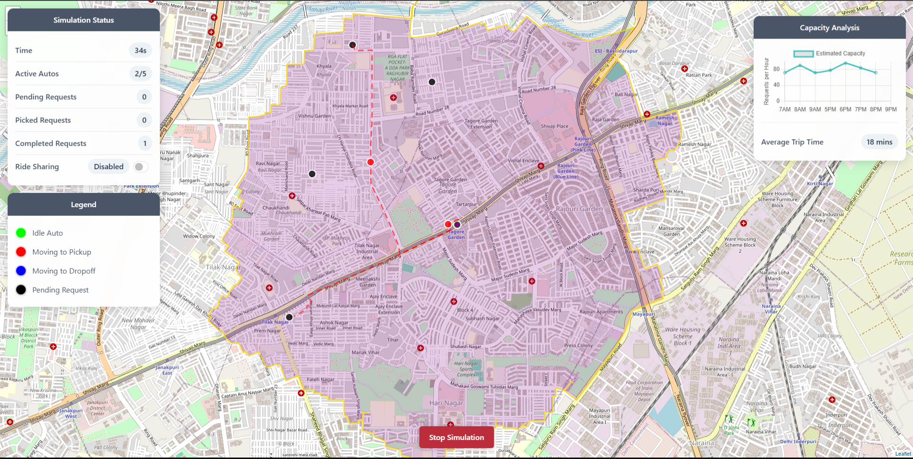

# LRTS-sim

> built as a demo for our solution first for Toyota Mobility Foundation Sustainable Cities challenge then the final form for Transport Stack Open Innovation Challenge by FITT IIT Delhi

LRTS-sim is a lightweight simulation environment for modeling and visualizing Local Rickshaw Transit System behavior before full deployment. It pairs Python-based simulation logic with HTML output pages or lightweight templates to communicate zone dynamics, wait times, and fleet distribution.

## Simulation Screenshot

## Purpose

This repository helps explore:
- How fleet size and distribution affect average passenger wait time
- Zone coverage optimization around metro hubs
- Subscription pass utilization modeling
- Baseline metrics for daily rides, driver activity, and landmark connectivity

## Tech Stack

- Python (simulation logic, data processing)
- HTML (static or templated visualization)

## Core Concepts

- Zone: Geographic cluster around a transit/metro node
- Fleet: Set of rickshaws assigned to zones with dynamic rebalancing
- Demand: Modeled passenger requests per time slice
- Pass Model: Subscription tiers altering trip frequency & travel paths

## Extending the Simulation

1. Add a new demand curve: implement in `demand.py`.
2. Adjust rebalancing strategy: modify `fleet.py`.
3. Integrate real data: create adapters under `analytics/`.
4. Export results: add CSV/JSON writers or simple APIs.

## Simulation Metrics

### Simulation Status
- **Time**: Current simulation time.
- **Active Autos**: Number of autos currently active (e.g., 2/5).
- **Pending Requests**: Number of requests waiting for assignment.
- **Picked Requests**: Number of requests currently in transit.
- **Completed Requests**: Total number of requests served.
- **Ride Sharing**: Status of ride-sharing logic (Enabled/Disabled).

### Capacity Analysis
- **Estimated Capacity**: Projected requests per hour across different times of day (7AM - 9PM).
- **Average Trip Time**: Estimated average duration of a trip (e.g., 18 mins).

## Acknowledgements

- Toyota Mobility Foundation Sustainable Cities Challenge
- FITT IIT Delhi Transport Stack Open Innovation Challenge
- Python & open data communities